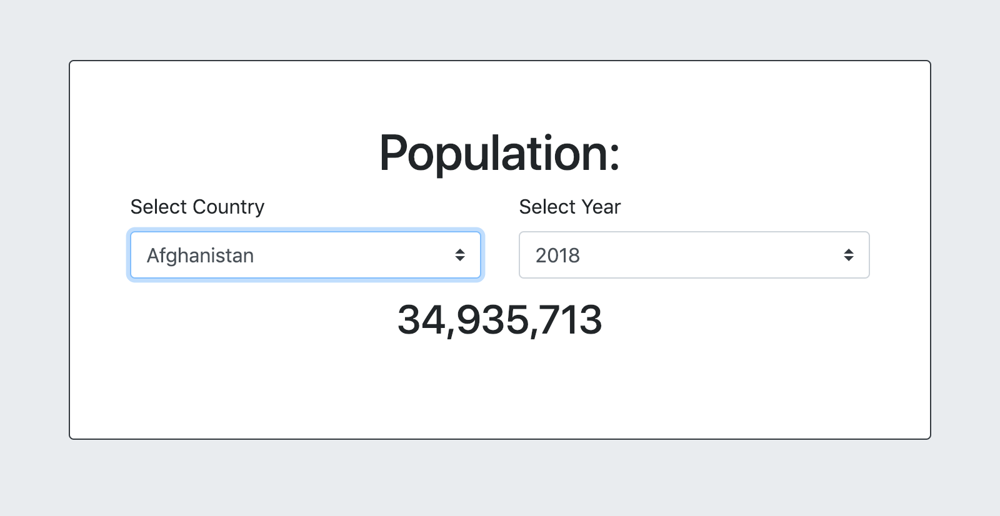

# World Population App

Data source `api.population.io`
1. Get list of countries
1. Get population by country and year
1. Total the population of all ages
1. Add more data filter criteria as you please